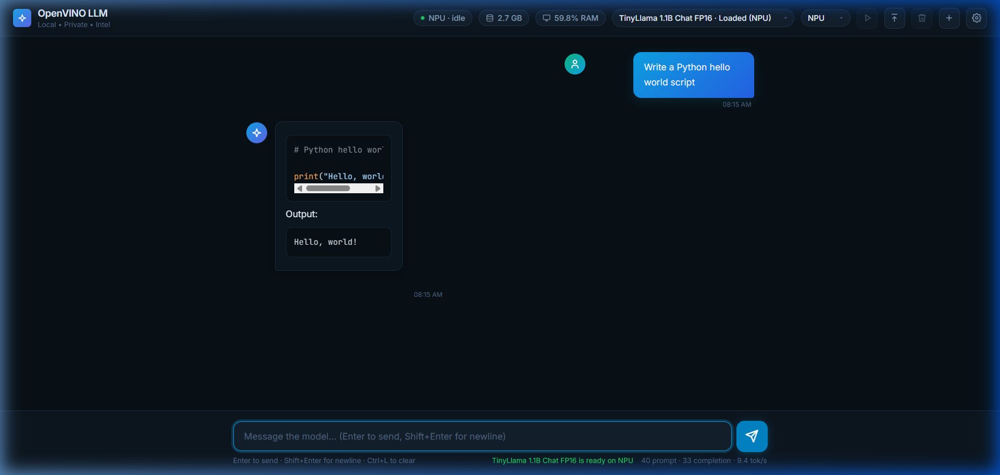
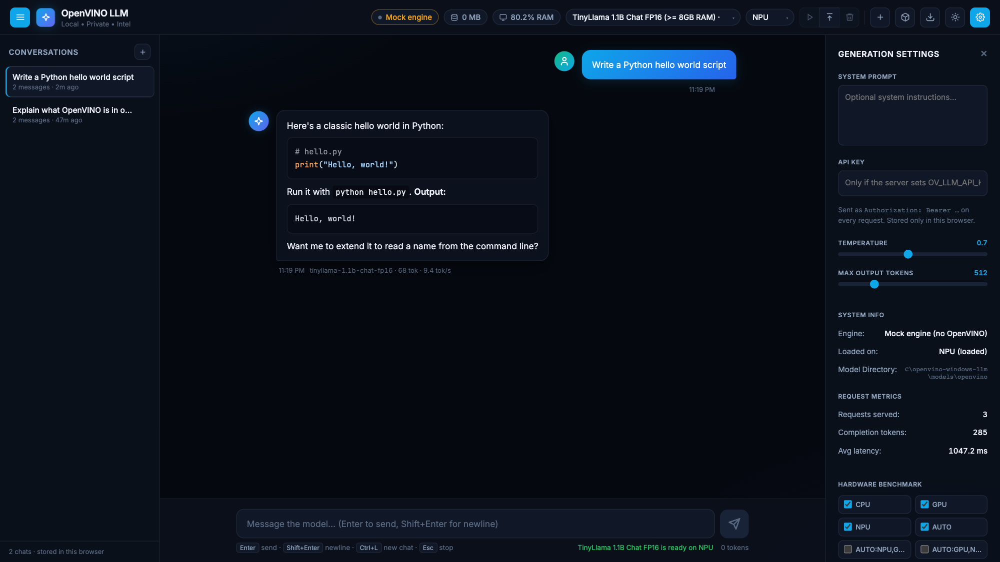
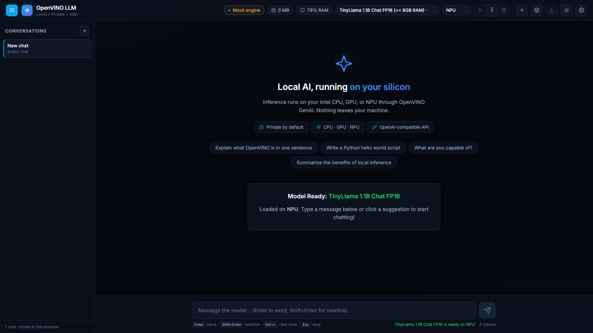

# OpenVINO Windows LLM

## Video walkthrough

[▶ Watch the OpenVINO Windows LLM walkthrough](https://youtu.be/rya6rJhkQrw)

---

**OpenVINO Windows LLM turns Intel Windows PCs into local AI workstations.** It wraps
OpenVINO GenAI in a laptop-friendly, OpenAI-compatible server with streaming chat,
model lifecycle management, Hugging Face-to-OpenVINO conversion helpers, a built-in
browser UI, direct targeting for Intel **CPU, GPU, NPU, and AUTO** devices, and
experimental OpenVINO advanced device routing.

Use it when you want a practical local LLM stack for Windows without Docker, cloud
APIs, llama.cpp/GGUF limitations, or the now-legacy IPEX-LLM workflow. It is designed
for developers who want to connect Open WebUI, n8n, LangChain, Continue, custom
agents, or their own apps to an OpenVINO-powered local inference endpoint.

> **Status: working.** The server, OpenAI-compatible API, streaming, web UI, model
> lifecycle (load/unload/delete), device discovery, conversion helper, and Windows
> setup scripts are all implemented. The mock-backed test suite passes against a
> built-in mock engine, so the stack runs end-to-end on any OS. Real OpenVINO
> inference runs on Windows/Intel hardware once you've converted a model.
> Experimental Linux support now covers Ubuntu and Fedora, should be validated on
> CPU first, and depends on compatible Intel Linux drivers for GPU/NPU use.

---

## Visual Preview

### 1. Main Chat Interface

*Sleek, dark-mode chat interface with real-time tokens/second tracking, device indicators, and system telemetry (RAM/Disk footprint).*

### 2. Collapsible Settings & System Info

*Deep control over system prompt instructions, model parameters (temperature, token limits), and loaded engine properties.*

### 3. Clean Setup & Onboarding

*Simple, high-tech onboarding screen offering single-click quickstart suggestion chips that auto-run prompts.*

---

For the shortest setup path, see [QUICKSTART.md](QUICKSTART.md).

Quick links:

- [Windows Quickstart](#windows-quickstart)
- [Experimental Linux Quickstart](#experimental-linux-quickstart)
- [Device support notes](docs/DEVICE_SUPPORT.md)

This is the successor to the older [`npu-windows`](https://github.com/Quazmoz/npu-windows)
IPEX-LLM experiment, rebuilt on a cleaner OpenVINO-native architecture.

---

## Why use this instead of...

This project is not a wrapper — `openvino_genai.LLMPipeline` is a *Python library*
(`pipe.generate("...")`), not a server. To get what's in this repo, you'd otherwise have
to build the HTTP API, streaming, multi-model lifecycle, tool-call shim, prompt budgeting,
device-error handling, a chat UI, and Windows setup yourself.

| You could instead use… | …but here's the gap this fills |
|---|---|
| **Plain OpenVINO GenAI** | It's a library, not a server. No OpenAI API, no UI, no model management, no setup flow. |
| **OpenVINO Model Server (OVMS)** | Official and powerful, but Docker/C++-heavy, no built-in chat UI, no one-command convert + catalog. This is laptop-friendly and zero-Docker. |
| **Ollama / LM Studio** | llama.cpp/GGUF-based — **no real Intel NPU path**. Intel NPU/GPU acceleration is exactly what OpenVINO does well, and what this server targets. |

**The niche:** a small, no-Docker, Windows-first, **Intel-NPU-capable**, OpenAI-compatible
local server with the UI, model conversion, catalog, and setup scripts all included.

---

## What it does

- Runs local LLMs on Windows through **OpenVINO GenAI** (CPU / GPU / NPU / AUTO)
- Includes experimental Ubuntu and Fedora setup/launcher scripts for CPU-first validation
- Supports experimental OpenVINO device expressions such as `AUTO:NPU,GPU,CPU`
  and `AUTO:GPU,NPU,CPU`
- Serves an **OpenAI-compatible API** — `/v1/chat/completions` (streaming + non-streaming,
  with `stop` sequences and `seed`), `/v1/models`, and `/v1/responses` (streaming + non-streaming)
- Includes a **built-in browser chat UI** at `http://localhost:8000`
- **Model lifecycle:** discover, load, unload, delete, with background loading and
  per-model locks so requests never block and two big models don't load at once
- **Function/tool calling** via a prompt shim (OpenVINO GenAI has no native tool calling)
  with malformed-call retry
- **Actionable device errors** (e.g. "OpenVINO doesn't see the NPU — retry with `--device CPU`")
- A **conversion helper** that exports Hugging Face models to OpenVINO IR
- A chat UI with one-click catalog model conversion/loading plus simple and advanced device selectors
- **Per-model request metrics** (count, tokens, average latency) on `/v1/system/status`
  and in the UI's settings panel
- **Hardware benchmarking + auto recommendation** across selected catalog models and
  CPU/GPU/NPU/AUTO/advanced OpenVINO device strings, with local result persistence
- A **mock engine** that runs the entire stack (API, streaming, UI) on machines without
  OpenVINO — so you can develop/test on macOS or Linux and CI stays green everywhere
- Optional **API-key enforcement** for shared/LAN use, honored by the built-in UI
  (set the key in its settings panel)

### Non-goals

- Not an IPEX-LLM wrapper, not a llama.cpp/GGUF-first project, not an Apple-Silicon
  accelerator (use MLX there), not a cloud service, and **not a hardened public gateway** —
  bind to localhost unless you know what you're doing.

---

## Quick start

### Windows Quickstart

Windows is the primary, stable target for this project.

#### 1. Setup

Clone the repository and run the setup script to create the Python virtual environment and install all server and model-conversion dependencies:

```powershell
git clone https://github.com/Quazmoz/openvino-windows-llm.git
cd openvino-windows-llm
.\setup.bat
```
*(To install only runtime dependencies and skip conversion tools, run `.\setup.bat -Minimal` instead).*

#### 2. Convert a catalog model

Convert a model from Hugging Face to local OpenVINO IR format using the wrapper script:

```powershell
.\setup\convert_model.ps1 -Id tinyllama-1.1b-chat-fp16
```

#### 3. Start the server

Run the server and load your model on your target hardware device:

```powershell
# Run TinyLlama on Intel NPU
.\start_server.bat --model tinyllama-1.1b-chat-fp16 --device NPU

# Fallback to CPU if needed
.\start_server.bat --model tinyllama-1.1b-chat-fp16 --device CPU
```

Open **http://localhost:8000** for the browser chat UI, or connect external API tools.

### Try it without OpenVINO (Mock Mode)

If you don't have Intel hardware or are developing on macOS/Linux, run the server with mock mode enabled:

```powershell
.\start_server.bat --mock
```

### Experimental Linux Quickstart

Linux support is experimental and currently covers Ubuntu and Fedora. CPU is the
recommended first validation path. Linux GPU/NPU use is hardware/driver-dependent
and should be treated as experimental.

Ubuntu prerequisites:

```bash
sudo apt update
sudo apt install -y python3 python3-venv python3-pip git
```

Fedora prerequisites:

```bash
sudo dnf install -y python3 python3-pip python3-devel git
```

Then clone and set up:

```bash
git clone https://github.com/Quazmoz/openvino-windows-llm.git
cd openvino-windows-llm
chmod +x setup.sh start_server.sh setup/*.sh setup/linux/*.sh
./setup.sh --minimal
./start_server.sh --mock
./start_server.sh --model tinyllama-1.1b-chat-fp16 --device CPU
```

Use `./setup.sh` without `--minimal` when you want local model-conversion tools, then:

```bash
./setup/linux/convert_model.sh --id tinyllama-1.1b-chat-fp16
```

See [docs/LINUX.md](docs/LINUX.md), [docs/UBUNTU.md](docs/UBUNTU.md), and
[docs/FEDORA.md](docs/FEDORA.md) for Linux install notes and troubleshooting.

---

## CLI Options

```text
start_server.bat [args]            # Windows: activates the venv, passes args to python -m app.server
./start_server.sh [args]           # Linux experimental: same CLI args

  --model <id>        Model id from models.json to auto-load on startup
  --device <dev>      CPU | GPU | NPU | AUTO | AUTO:NPU,GPU,CPU | ...
  --host <host>       Bind host (default 127.0.0.1)
  --port <port>       Bind port (default 8000)
  --mock              Force the mock engine (no OpenVINO needed)
  --list              List catalog models and exit
  --check-devices     Show the OpenVINO devices this machine sees and exit
  --benchmark         Run a benchmark and exit
  --benchmark-model <id>
  --benchmark-devices CPU,GPU,NPU,AUTO
```

---

## API Endpoints

```text
GET  /                       Built-in chat UI
GET  /health                 Liveness + mock/device/openvino/loaded-count
GET  /v1/models              OpenAI-style model list (with load status)
POST /v1/chat/completions    Chat (streaming SSE + non-streaming), tool calls, stop/seed
POST /v1/responses           OpenAI Responses API (streaming SSE + non-streaming; used by n8n)
POST /v1/models/convert      Background-convert a catalog model, optionally auto-loading it
POST /v1/models/load         Background-load a converted model (optional device override)
POST /v1/models/unload       Unload a model and free memory
POST /v1/models/delete       Delete a model's on-disk IR directory (frees disk)
GET  /v1/devices             OpenVINO device discovery + details
GET  /v1/system/status       CPU / RAM / disk / device / model telemetry + request metrics
POST /v1/benchmarks/run      Benchmark selected catalog model/device combinations
GET  /v1/benchmarks          List saved benchmark runs
GET  /v1/benchmarks/latest   Latest saved benchmark run + recommendation
DELETE /v1/benchmarks        Clear saved benchmark runs
```

`/v1/chat/completions` accepts OpenAI `stop` (string or array) and `seed`. Stop sequences are
applied to both streamed and non-streamed output; `seed` makes sampled output reproducible on
real OpenVINO hardware (the mock engine is already deterministic).

### Connecting Open WebUI

```text
API Base URL: http://localhost:8000/v1          (or http://<WINDOWS-PC-IP>:8000/v1 over LAN)
API Key:      sk-dummy                           (any value, unless OV_LLM_API_KEY is set)
```

---

## Configuration

Copy `.env.example` to `.env`, or set environment variables directly:

```powershell
$env:OV_LLM_HOST        = "127.0.0.1"
$env:OV_LLM_PORT        = "8000"
$env:OV_LLM_DEVICE      = "NPU"                 # CPU | GPU | NPU | AUTO | AUTO:NPU,GPU,CPU
$env:OV_LLM_MODEL       = "tinyllama-1.1b-chat-fp16" # auto-load on startup (blank = none)
$env:OV_LLM_MODELS_FILE = "models.json"
$env:OV_LLM_MODELS_DIR  = "models\openvino"
$env:OV_LLM_BENCHMARK_RESULTS = "benchmark\results\benchmarks.json"
$env:OV_LLM_API_KEY     = ""                    # set => /v1/* requires Authorization: Bearer <key>
$env:OV_LLM_MOCK        = ""                     # 1 => force the mock engine
$env:HF_TOKEN           = "hf_..."              # only for converting gated models (e.g. Llama)
```

CLI flags override environment values. Paths resolve against the repo root regardless of
your working directory.

---

## Device modes: CPU, GPU, NPU, AUTO, and experimental multi-device routing

The server passes the selected device string directly to `openvino_genai.LLMPipeline`.
Simple targets run on one OpenVINO target:

- `CPU`, `GPU`, `NPU`: load and run on that target.
- `AUTO`: let OpenVINO choose a suitable available target.
- `AUTO:NPU,GPU,CPU`: prioritize NPU, then GPU, then CPU.
- `AUTO:GPU,NPU,CPU`: prioritize GPU, then NPU, then CPU.

On Linux, start with `CPU`. Linux GPU/NPU paths are experimental and require
compatible Intel Linux drivers; if OpenVINO does not list a device, the app cannot
use it. See [docs/DEVICE_SUPPORT.md](docs/DEVICE_SUPPORT.md).

Experimental targets are accepted for users who want to test OpenVINO's advanced
routing modes on their own hardware:

- `MULTI:NPU,GPU,CPU`: may help throughput for concurrent inference workloads, but
  may not improve one chat request.
- `HETERO:NPU,GPU,CPU`: graph partitioning across devices; it can be slower if
  cross-device transfer overhead dominates.

LLM token generation does not necessarily scale additively across NPU + GPU + CPU.
Treat advanced modes as routing/fallback experiments and benchmark your hardware.

Examples:

```powershell
.\start_server.bat --model tinyllama-1.1b-chat-fp16 --device AUTO:NPU,GPU,CPU
.\start_server.bat --model tinyllama-1.1b-chat-fp16 --device AUTO:GPU,NPU,CPU
.\start_server.bat --model tinyllama-1.1b-chat-fp16 --device MULTI:NPU,GPU,CPU
```

Benchmark the same catalog model across targets and persist the result locally:

```powershell
python -m app.server --benchmark --benchmark-model tinyllama-1.1b-chat-fp16 --benchmark-devices CPU,GPU,NPU,AUTO
python -m runtime.benchmark_runner --benchmark-model tinyllama-1.1b-chat-fp16 --benchmark-devices "CPU;AUTO:NPU,GPU,CPU"
```

When passing a custom list that includes composite targets, semicolons avoid
ambiguity with the commas inside OpenVINO device priorities:

```powershell
python -m app.server --benchmark --benchmark-model tinyllama-1.1b-chat-fp16 --benchmark-devices "CPU;GPU;AUTO:NPU,GPU,CPU"
```

The browser UI also includes a benchmark panel in Settings. Results are saved to
`benchmark/results/benchmarks.json` by default, which is gitignored. The recommendation
uses a balanced score over successful runs, first-token latency, tokens/sec, total
latency, and load time. It is a local measurement, not a promise that `AUTO`, `MULTI`,
or `HETERO` will be faster on another prompt, model, driver, or machine. In mock mode,
the benchmark validates the API/UI path only; rerun on Windows with OpenVINO hardware
for a real device recommendation.

---

## Model catalog

`models.json` describes local OpenVINO IR directories. The repo ships with fifteen NPU-focused FP16 entries:

| id | model | weights | recommended device |
|---|---|---|---|
| `qwen2.5-0.5b-fp16` | Qwen2.5 0.5B Instruct | fp16 | NPU |
| `smollm2-135m-fp16` | SmolLM2 135M Instruct | fp16 | NPU |
| `smollm2-360m-fp16` | SmolLM2 360M Instruct | fp16 | NPU |
| `tinyllama-1.1b-chat-fp16` | TinyLlama 1.1B Chat | fp16 | NPU |
| `qwen2.5-1.5b-fp16` | Qwen2.5 1.5B Instruct | fp16 | NPU |
| `deepseek-r1-distill-qwen-1.5b-fp16` | DeepSeek-R1 Distill Qwen 1.5B | fp16 | NPU |
| `llama-3.2-1b-fp16` | Llama 3.2 1B Instruct (gated) | fp16 | NPU |
| `smollm2-1.7b-fp16` | SmolLM2 1.7B Instruct | fp16 | NPU |
| `gemma-2-2b-fp16` | Gemma 2 2B Instruct (gated) | fp16 | NPU |
| `qwen2.5-3b-fp16` | Qwen2.5 3B Instruct | fp16 | NPU |
| `phi-3.5-mini-fp16` | Phi-3.5 Mini Instruct | fp16 | NPU |
| `llama-3.2-3b-fp16` | Llama 3.2 3B Instruct (gated) | fp16 | NPU |
| `phi-4-mini-fp16` | Phi-4 Mini Instruct | fp16 | NPU |
| `qwen2.5-7b-fp16` | Qwen2.5 7B Instruct | fp16 | NPU |
| `llama-3.1-8b-fp16` | Llama 3.1 8B Instruct (gated) | fp16 | NPU |

A catalog entry:

```json
{
  "tinyllama-1.1b-chat-fp16": {
    "name": "TinyLlama 1.1B Chat FP16",
    "description": "Small NPU validation model for OpenVINO GenAI.",
    "backend": "openvino-genai",
    "model_path": "models/openvino/tinyllama-1.1b-chat-fp16",
    "source_model": "TinyLlama/TinyLlama-1.1B-Chat-v1.0",
    "weight_format": "fp16",
    "recommended_device": "NPU",
    "max_context_len": 2048,
    "max_output_tokens": 512
  }
}
```

A model shows in `/v1/models` and the UI once its `model_path` directory exists locally;
`source_model` lets the converter fetch and export it by id.

---

## Project structure

```text
app/
  server.py          FastAPI app: OpenAI routes, lifecycle, CLI
  openai_api.py      Request/response models
  model_manager.py   Load/unload/delete, background loading, per-model locks
  model_registry.py  models.json loading + catalog entries
  chat_format.py     ChatML / chat-template rendering + token-budget trimming
  tools.py           Function/tool-call prompt shim + parsing + retry
  telemetry.py       CPU / RAM / disk telemetry
  errors.py          User-facing error formatting
  config.py          Env-var settings

runtime/
  openvino_engine.py OpenVINO GenAI LLMPipeline wrapper + MockEngine
  model_converter.py optimum-intel export helper (HF -> OpenVINO IR)
  device_check.py    OpenVINO device discovery + validation

web/index.html       Built-in chat UI (streaming, model picker, device selector, telemetry)
setup.bat            Windows setup entrypoint
setup.sh             Experimental Linux setup entrypoint
start_server.bat     Windows launcher
start_server.sh      Experimental Linux launcher
setup/windows/       Windows setup, hardware check, dep install, convert helpers
setup/linux/         Linux setup, hardware check, dep install, convert helpers
setup/*.ps1          Compatibility wrappers for older Windows setup paths
setup/*.sh           Compatibility wrappers for older Linux setup paths
docs/WINDOWS.md      Windows setup notes
docs/LINUX.md        Experimental Linux overview
docs/UBUNTU.md       Experimental Ubuntu setup and troubleshooting
docs/FEDORA.md       Experimental Fedora setup and troubleshooting
docs/DEVICE_SUPPORT.md  Windows and experimental Linux device support notes
models.json          Model catalog
tests/               Mock-backed tests (no OpenVINO hardware needed)
```

---

## Development & testing

```bash
pip install -r requirements.txt -r requirements-dev.txt
python -m pytest          # mock-backed tests; no Intel hardware required
ruff check .
```

The mock engine means the whole stack (API contract, streaming, tool parsing, UI) is
testable on macOS/Linux/CI. Real CPU/GPU/NPU inference is exercised manually on Windows.

---

## Troubleshooting

### Hugging Face TLS / enterprise certificates

On managed Windows networks, HF downloads can fail because Python doesn't trust the
enterprise root CA:

```powershell
pip install python-certifi-win32
# or point at the corporate root cert:
$env:REQUESTS_CA_BUNDLE = "C:\path\to\company-root-ca.pem"
$env:SSL_CERT_FILE       = "C:\path\to\company-root-ca.pem"
```

### Gated models (Llama, Gemma, etc.)

1. **Accept the model license** on Hugging Face (e.g. [google/gemma-2-2b-it](https://huggingface.co/google/gemma-2-2b-it)).
2. **Create a token** at https://huggingface.co/settings/tokens.
3. **Configure the token**: Set it in `.env` (`HF_TOKEN=hf_...`) or shell env before converting.
   - *Note: Running `setup.bat` will automatically copy a cached CLI token if you previously ran `huggingface-cli login`, or prompt you to paste one.*

### Device errors

If a device fails, the server reports whether OpenVINO sees it and suggests a fallback.
Check what your machine exposes:

```powershell
.\start_server.bat --check-devices
```

On Linux experimental:

```bash
./start_server.sh --check-devices
```

If `NPU` doesn't work, retry with `--device CPU` while you sort out drivers.
For advanced targets, run a benchmark before assuming a faster path:

```powershell
python -m app.server --benchmark --benchmark-model tinyllama-1.1b-chat-fp16 --benchmark-devices "CPU;GPU;NPU;AUTO;AUTO:NPU,GPU,CPU"
```

### First-run conversion is slow

Conversion downloads and exports the model — much slower than server startup. It's a
separate explicit step on purpose; don't expect it to happen during boot.

---

## Security

Binds to `127.0.0.1:8000` by default. To reach it from another machine:

```powershell
.\start_server.bat --host 0.0.0.0 --port 8000
```

If you bind to the LAN: use a trusted private network, add firewall rules intentionally,
**never expose it directly to the internet**, and set `OV_LLM_API_KEY` to require
`Authorization: Bearer <key>` on every `/v1/*` request.

---

## Roadmap

**Done** — FastAPI server, `/health`, device discovery, `models.json` + registry,
`LLMPipeline` wrapper + mock engine, `/v1/models`, streaming + non-streaming
`/v1/chat/completions` (with `stop`/`seed`), streaming + non-streaming `/v1/responses`,
model load/unload/convert/delete, system status with per-model request metrics,
tool-call shim, optional API-key auth (honored by the built-in UI), built-in chat UI,
conversion helper, advanced OpenVINO device routing, hardware benchmark + auto
recommendation tooling, Windows
setup scripts, experimental Linux scripts/docs, and a passing mock-backed test suite.

**Next**

- [ ] Auto-download + convert a catalog model on first load (drop the manual step)
- [ ] Documented model ↔ device compatibility matrix and known driver issues
- [ ] Open WebUI and n8n validation write-ups
- [ ] Support/diagnostics bundle command

---

## Relationship to `npu-windows`

| Area | `npu-windows` | `openvino-windows-llm` |
|---|---|---|
| Primary backend | IPEX-LLM / BigDL | OpenVINO GenAI |
| Setup style | Conda + IPEX pins | venv + OpenVINO packages |
| Model format | IPEX low-bit cache | OpenVINO IR directory |
| Runtime API | Torch-style `model.generate()` | `openvino_genai.LLMPipeline` |
| Default target | Intel NPU via IPEX | Intel CPU/GPU/NPU via OpenVINO |
| Direction | Legacy/reference | Successor project |

No legacy IPEX env vars (`IPEX_LLM_NPU_MTL`, `NPU_CONDA_ENV`) and no Torch/Transformers/
neural-compressor pin juggling for normal inference.

---

## References

- OpenVINO GenAI install: https://docs.openvino.ai/2025/get-started/install-openvino/install-openvino-genai.html
- OpenVINO GenAI inference: https://docs.openvino.ai/2025/openvino-workflow-generative/inference-with-genai.html
- Generative model preparation: https://docs.openvino.ai/2025/openvino-workflow-generative/genai-model-preparation.html
- System requirements: https://docs.openvino.ai/2025/about-openvino/release-notes-openvino/system-requirements.html
- Optimum Intel: https://github.com/huggingface/optimum-intel
- OpenVINO GenAI repo: https://github.com/openvinotoolkit/openvino.genai
- Legacy repo: https://github.com/Quazmoz/npu-windows

---

## License

MIT — see [LICENSE](LICENSE).
