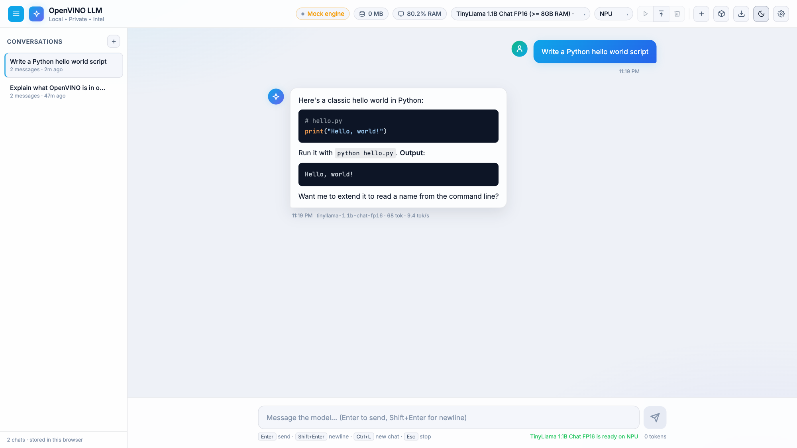

# OpenVINO Windows LLM

## Video walkthrough

[▶ Watch the OpenVINO Windows LLM walkthrough](https://youtu.be/rya6rJhkQrw)

---

**OpenVINO Windows LLM turns Intel Windows PCs into local AI workstations.** It wraps
OpenVINO GenAI in a Windows-first, OpenAI-compatible server with streaming chat, model
conversion and lifecycle management, CPU/GPU/NPU targeting, hardware benchmarking, a
built-in browser UI, and a deterministic mock engine for portable development.

Use it when you want a practical local LLM endpoint without Docker, cloud inference, or
a Node frontend toolchain. It is designed to connect Open WebUI, n8n, OpenAI-compatible
SDKs, custom agents, and local applications to OpenVINO-backed inference.

> **Current status:** The API, built-in UI, conversion flow, lifecycle management,
> streaming, mock engine, benchmark runner, and Windows setup scripts are implemented.
> CI verifies the application and external HTTP contract in mock mode. Real CPU, GPU,
> and NPU claims must be backed by a Windows hardware certification report generated by
> this repository. Experimental Linux support covers Ubuntu and Fedora, with CPU as the
> recommended first validation target.

## Visual preview

Screenshots were captured with the mock engine. On real Windows hardware, the device
status reflects the active OpenVINO target.

### Main chat interface


Streaming safe local Markdown chat with conversation history, per-message statistics, copy and
regenerate actions, model status, and system telemetry.

### Settings and system information


System prompt and generation controls, API-key configuration, request metrics, activity
state, and hardware benchmarking.

### First-run model flow


Catalog model selection, conversion progress, loading state, and quick-start prompts.

### Light theme and responsive layout



The UI supports light and dark themes and responsive layouts. See
[`screenshots/responsive_preview.png`](screenshots/responsive_preview.png) for the
narrow layout.

## Documentation

- [Quick start](QUICKSTART.md)
- [Windows setup](docs/WINDOWS.md)
- [Windows hardware certification](docs/WINDOWS_CERTIFICATION.md)
- [API contract](docs/API_CONTRACT.md)
- [Local vision chat](docs/VISION.md)
- [Open WebUI and n8n integrations](docs/INTEGRATIONS.md)
- [Device support](docs/DEVICE_SUPPORT.md)
- [Experimental Linux overview](docs/LINUX.md)
- [Ubuntu notes](docs/UBUNTU.md)
- [Fedora notes](docs/FEDORA.md)

This project succeeds the older
[`npu-windows`](https://github.com/Quazmoz/npu-windows) IPEX-LLM experiment with an
OpenVINO-native architecture.

---

## Why this project exists

`openvino_genai.LLMPipeline` is a Python inference library, not a complete local server.
A usable workstation stack also needs HTTP contracts, streaming, model lifecycle
management, prompt budgeting, device errors, conversion tooling, diagnostics, and a
client interface.

| Alternative | Gap this project fills |
|---|---|
| Plain OpenVINO GenAI | Adds an OpenAI-style server, browser UI, lifecycle, conversion, and diagnostics. |
| OpenVINO Model Server | Provides a lighter Windows laptop workflow with no Docker requirement and a built-in chat UI. |
| Ollama or LM Studio | Keeps an OpenVINO path for Intel CPU, GPU, and NPU instead of a GGUF-first runtime. |

The niche is a small, local-first, Windows-first OpenVINO server with an Intel NPU path,
OpenAI-compatible endpoints, built-in UI, and deterministic mock portability.

## Implemented capabilities

### Inference and compatibility

- OpenVINO GenAI text generation on `CPU`, `GPU`, `NPU`, `AUTO`, and accepted advanced
  OpenVINO device expressions
- `POST /v1/chat/completions` with streaming and non-streaming output
- `POST /v1/responses` with streaming and non-streaming output
- `POST /v1/embeddings` for catalog models using the embeddings backend
- OpenAI-compatible image content parts for models registered with the `openvino-vlm`
  backend, including browser file, paste, and drag-and-drop input
- safe-by-default custom model conversion with Hugging Face remote code execution disabled
  unless the operator explicitly opts in for a reviewed repository
- stop sequences, seed, temperature, top-p, and token limits
- tool/function request compatibility through a prompt and parsing shim
- structured-output request forwarding when supported by the installed OpenVINO GenAI
- optional dynamic LoRA request fields when supported by the runtime
- optional speculative decoding with a compatible draft model

### Model and device operations

- catalog discovery and custom Hugging Face registration
- background conversion with progress and sanitized log tails
- optional auto-download and conversion on load
- per-model load, unload, and delete operations
- per-model locks and serialized heavyweight model preparation
- stream cancellation that releases generation locks
- OpenVINO device discovery with actionable errors
- hardware benchmarks with local result persistence and recommendations

### Server and UI

- built-in responsive browser chat interface at `http://127.0.0.1:8000`
- multiple browser-local conversations
- streamed dependency-free Markdown, code-block copy actions, and chat export
- model and device controls
- light and dark themes
- system telemetry, request metrics, lifecycle progress, and recent safe activity
- optional API-key enforcement
- configurable CORS origins and per-IP rate limiting
- liveness and readiness endpoints
- request IDs and sanitized operational errors

### Development portability

- deterministic mock text and embedding engines
- mock-backed test suite with no Intel hardware requirement
- external black-box API validator used by CI
- Windows certification harness for real hardware evidence
- experimental Ubuntu and Fedora scripts and documentation

## Validation levels

The repository uses explicit validation levels so mock behavior is not confused with
hardware support.

| Level | Evidence |
|---|---|
| Mock contract | Unit tests and black-box API validation run with the built-in mock engine. |
| Windows CPU certified | `scripts/validate_windows.ps1` completed with mock disabled on CPU. |
| Windows GPU certified | Certification completed on an OpenVINO-visible Intel GPU. |
| Windows NPU certified | Certification completed on an OpenVINO-visible Intel NPU. |
| Client verified | The actual external client version was manually connected after its contract profile passed. |

Generate real hardware evidence with:

```powershell
.\scripts\validate_windows.ps1
```

See [Windows hardware certification](docs/WINDOWS_CERTIFICATION.md) for report contents,
privacy controls, and interpretation.

---

## Quick start

### Windows

Windows is the primary target.

#### 1. Set up the environment

```powershell
git clone https://github.com/Quazmoz/openvino-windows-llm.git
cd openvino-windows-llm
.\setup.bat
```

Use `.\setup.bat -Minimal` only when you do not need local model-conversion tools.

#### 2. Start with automatic conversion

```powershell
.\start_server.bat `
  --model tinyllama-1.1b-chat-fp16 `
  --device CPU `
  --auto-convert
```

The first run downloads and converts the catalog model when it is not already present.
This is much slower than a normal server restart.

For an explicit conversion step instead:

```powershell
.\setup\convert_model.ps1 -Id tinyllama-1.1b-chat-fp16
.\start_server.bat --model tinyllama-1.1b-chat-fp16 --device CPU
```

Switch to `NPU`, `GPU`, or `AUTO` only when OpenVINO reports the target:

```powershell
.\start_server.bat --check-devices
```

Open `http://127.0.0.1:8000` for the built-in UI.

### Mock mode

Mock mode validates the complete server and UI without real OpenVINO inference:

```powershell
.\start_server.bat --mock
```

It is suitable for UI development, API contract tests, and CI. It is not hardware
evidence.

### Experimental Linux

```bash
git clone https://github.com/Quazmoz/openvino-windows-llm.git
cd openvino-windows-llm
chmod +x setup.sh start_server.sh setup/*.sh setup/linux/*.sh
./setup.sh --minimal
./start_server.sh --mock
./start_server.sh --model tinyllama-1.1b-chat-fp16 --device CPU
```

Use `./setup.sh` without `--minimal` for conversion tooling. Linux GPU and NPU support
remains driver-dependent and experimental.

---

## CLI

```text
start_server.bat [args]
./start_server.sh [args]

  --model <id>              Catalog model to load on startup
  --device <expression>     CPU | GPU | NPU | AUTO | AUTO:NPU,GPU,CPU | ...
  --host <host>             Bind host, default 127.0.0.1
  --port <port>             Bind port, default 8000
  --mock                    Force the mock engine
  --auto-convert            Convert a missing catalog model before loading
  --list                    List catalog models and exit
  --check-devices           Print OpenVINO-visible devices and exit
  --benchmark               Run a benchmark and exit
  --benchmark-model <id>    Catalog model for benchmark mode
  --benchmark-devices <set> Device list for benchmark mode
  --benchmark-runs <count>  Generations per model/device combination
  --benchmark-max-tokens <n>
```

Use semicolons when a device list contains composite expressions:

```powershell
python -m app.server `
  --benchmark `
  --benchmark-model tinyllama-1.1b-chat-fp16 `
  --benchmark-devices "CPU;GPU;NPU;AUTO;AUTO:NPU,GPU,CPU"
```

## API overview

```text
GET    /                         Built-in chat UI
GET    /health                   Runtime and lifecycle summary
GET    /health/live              Liveness probe
GET    /health/ready             Readiness probe

GET    /v1/models                OpenAI-style model list
POST   /v1/chat/completions      Chat, streaming or non-streaming
POST   /v1/responses             Responses API, streaming or non-streaming
POST   /v1/embeddings            Float or base64 embeddings

POST   /v1/models/register       Register a custom catalog model
GET    /v1/models/search-hf      Search Hugging Face model metadata
POST   /v1/models/download-custom Register and convert a custom model
POST   /v1/models/convert        Convert a catalog model
POST   /v1/models/load           Load a model on a selected device
POST   /v1/models/unload         Unload a model
POST   /v1/models/delete         Delete an unloaded model's local IR files

GET    /v1/devices               Device discovery and suggestions
GET    /v1/system/status         Telemetry, models, progress, metrics, events
GET    /v1/keys/stats            Per-key usage counters without key disclosure
POST   /v1/benchmarks/run        Run hardware benchmarks
GET    /v1/benchmarks            List saved benchmark runs
GET    /v1/benchmarks/latest     Latest run and recommendation
DELETE /v1/benchmarks            Clear saved benchmark runs
POST   /v1/chat/export           Export supplied messages as Markdown
```

See [API contract](docs/API_CONTRACT.md) for supported fields, streaming event shapes,
error behavior, and validation boundaries.

### External client contract validation

Validate an already-running server without installing an OpenAI SDK:

```powershell
python .\scripts\validate_api_contract.py `
  --base-url http://127.0.0.1:8000 `
  --profile full `
  --model tinyllama-1.1b-chat-fp16 `
  --device CPU `
  --expect-real
```

Profiles are available for `core`, `openwebui`, `n8n`, and `full`.

### Open WebUI

```text
Base URL: http://127.0.0.1:8000/v1
API key:  any non-empty value when auth is disabled
API key:  the configured OV_LLM_API_KEY when auth is enabled
```

See [external client integrations](docs/INTEGRATIONS.md) before binding beyond localhost.

---

## Built-in UI

### Chat

- streaming dependency-free Markdown responses
- code blocks and copy actions without external CDN dependencies
- multiple browser-local conversations
- per-message model, token, and throughput information
- regenerate and Markdown export actions
- structured tool-call cards when a model emits a valid call

### Model and device management

- model state from not converted through loaded
- conversion and loading progress
- catalog and custom Hugging Face model flows
- CPU, GPU, NPU, AUTO, and accepted advanced device expressions
- unload and delete controls with lifecycle guards

### Settings and diagnostics

- system prompt, temperature, and output-token controls
- API-key field for protected local servers
- memory, disk, CPU, GPU, and device status
- request metrics and local benchmark controls
- bounded safe activity feed

Conversation data is stored in browser localStorage. It is not persisted by the server.

---

## Configuration

Copy `.env.example` to `.env` or set variables directly:

```powershell
$env:OV_LLM_HOST = "127.0.0.1"
$env:OV_LLM_PORT = "8000"
$env:OV_LLM_DEVICE = "CPU"
$env:OV_LLM_MODEL = "tinyllama-1.1b-chat-fp16"
$env:OV_LLM_MODELS_FILE = "models.json"
$env:OV_LLM_MODELS_DIR = "models\openvino"
$env:OV_LLM_CACHE_DIR = "models\cache"
$env:OV_LLM_BENCHMARK_RESULTS = "benchmark\results\benchmarks.json"
$env:OV_LLM_AUTO_CONVERT = "1"
$env:OV_LLM_API_KEY = ""
$env:OV_LLM_CORS_ORIGINS = ""
$env:OV_LLM_RATE_LIMIT = "0"
$env:OV_LLM_MOCK = ""
$env:HF_TOKEN = ""
```

| Variable | Purpose |
|---|---|
| `OV_LLM_HOST` | Bind address. Keep `127.0.0.1` unless LAN access is deliberate. |
| `OV_LLM_PORT` | HTTP port. |
| `OV_LLM_DEVICE` | Default OpenVINO device expression. |
| `OV_LLM_MODEL` | Optional startup model. |
| `OV_LLM_MODELS_FILE` | Model catalog path. |
| `OV_LLM_MODELS_DIR` | Converted-model root. |
| `OV_LLM_CACHE_DIR` | OpenVINO compiled-model cache. |
| `OV_LLM_BENCHMARK_RESULTS` | Local benchmark JSON store. |
| `OV_LLM_AUTO_CONVERT` | Convert a missing catalog model during load. |
| `OV_LLM_API_KEY` | One key or comma-separated keys for `/v1/*`. |
| `OV_LLM_CORS_ORIGINS` | Explicit comma-separated browser origins; blank disables cross-origin access. |
| `OV_LLM_MAX_REQUEST_BODY_MB` | Maximum HTTP request body size in MiB. Defaults to 40. |
| `OV_LLM_RATE_LIMIT` | Per-IP requests per minute, `0` disables it. |
| `OV_LLM_MOCK` | Force mock mode. |
| `HF_TOKEN` | Hugging Face token for gated conversion. |

CLI flags override environment values. Repository-relative paths resolve against the
repository root.

## Device behavior

Simple targets:

- `CPU`
- `GPU`
- `NPU`
- `AUTO`

Accepted advanced examples:

- `AUTO:NPU,GPU,CPU`
- `AUTO:GPU,NPU,CPU`
- `MULTI:NPU,GPU,CPU`
- `HETERO:NPU,GPU,CPU`

Advanced expressions are OpenVINO routing experiments. They do not guarantee additive
performance or lower latency. Benchmark the actual model, driver, and machine.

OpenVINO discovery is the source of truth:

```powershell
.\start_server.bat --check-devices
```

If OpenVINO does not list a direct device, this server cannot use it.

## Model catalog

`models.json` contains text-generation and embedding examples. Each entry specifies:

```json
{
  "tinyllama-1.1b-chat-fp16": {
    "name": "TinyLlama 1.1B Chat FP16",
    "description": "Small NPU validation model for OpenVINO GenAI.",
    "backend": "openvino-genai",
    "model_path": "models/openvino/tinyllama-1.1b-chat-fp16",
    "source_model": "TinyLlama/TinyLlama-1.1B-Chat-v1.0",
    "weight_format": "fp16",
    "recommended_device": "NPU",
    "max_context_len": 2048,
    "max_output_tokens": 512,
    "trust_remote_code": false
  }
}
```

A recommendation is a starting point, not certification. Model size, format, driver,
memory, and OpenVINO release all affect compatibility.

`trust_remote_code` defaults to `false`. Enable it only for a reviewed Hugging Face
repository whose custom Python code you explicitly trust to execute during conversion.

---

## Project structure

```text
app/
  server.py
  openai_api.py
  model_manager.py
  model_registry.py
  chat_format.py
  tools.py
  telemetry.py
  errors.py
  config.py

runtime/
  openvino_engine.py
  model_converter.py
  device_check.py
  benchmark_runner.py

scripts/
  validate_api_contract.py
  validate_windows.ps1

web/index.html
setup.bat
setup.sh
start_server.bat
start_server.sh
models.json
tests/
docs/
```

## Development and testing

```bash
pip install -e .[dev]
ruff check .
ruff format --check .
pytest
```

Run the external contract suite against a mock server:

```bash
OV_LLM_MOCK=1 python -m app.server \
  --mock \
  --host 127.0.0.1 \
  --port 8123 \
  --model tinyllama-1.1b-chat-fp16

python scripts/validate_api_contract.py \
  --base-url http://127.0.0.1:8123 \
  --profile full \
  --expect-mock \
  --include-embeddings \
  --run-benchmark \
  --exercise-lifecycle
```

Mock tests validate contracts and state transitions. Real OpenVINO behavior is validated
with the Windows certification harness.

## Troubleshooting

### Hugging Face TLS on managed Windows networks

```powershell
pip install python-certifi-win32
$env:REQUESTS_CA_BUNDLE = "C:\path\to\company-root-ca.pem"
$env:SSL_CERT_FILE = "C:\path\to\company-root-ca.pem"
```

### Gated models

1. Accept the model license on Hugging Face.
2. Create an appropriate Hugging Face token.
3. Set `HF_TOKEN` before conversion.

### Device errors

```powershell
.\start_server.bat --check-devices
```

Start with CPU when GPU or NPU discovery fails. Do not report a target as supported until
a real certification profile passes.

### First conversion takes a long time

Conversion downloads source weights and exports OpenVINO IR. Use `--auto-convert` for a
single first-run flow or call the conversion helper explicitly. Later starts reuse the
converted model and compiled-model cache.

---

## Security

The safe default is `127.0.0.1:8000`.

LAN binding is an advanced mode:

```powershell
$env:OV_LLM_API_KEY = "replace-with-a-local-secret"
$env:OV_LLM_CORS_ORIGINS = "http://trusted-client:3000"
.\start_server.bat --host 0.0.0.0 --port 8000
```

When using LAN access:

- use a trusted private network
- configure Windows Firewall intentionally
- require an API key
- restrict CORS to known browser origins
- consider a local reverse proxy for TLS and stronger policy
- never expose the server directly to the public internet

This is a local inference server, not a hardened public gateway.

## Roadmap

### Completed

- Windows-first OpenVINO GenAI server
- mock-backed API and UI testing
- Chat Completions, Responses, and Embeddings routes
- streaming cancellation and model lifecycle locks
- conversion, auto-conversion, custom registration, and deletion flows
- optional API keys, CORS controls, and rate limiting
- system telemetry and benchmark recommendations
- built-in browser UI
- external API contract validator
- Windows hardware certification harness and sanitized evidence reports
- Open WebUI and n8n contract documentation
- experimental Ubuntu and Fedora support

### Next

- publish reviewed real-hardware compatibility rows from certification reports
- add a support and diagnostics bundle command
- validate specific Open WebUI and n8n releases manually
- improve model and driver issue documentation as real reports accumulate
- produce a versioned portable Windows release after certification succeeds

## Relationship to `npu-windows`

| Area | `npu-windows` | `openvino-windows-llm` |
|---|---|---|
| Backend | IPEX-LLM and BigDL | OpenVINO GenAI |
| Setup | Conda and legacy pins | Python venv and OpenVINO packages |
| Model format | IPEX low-bit cache | OpenVINO IR directory |
| Runtime | Torch-style generation | `openvino_genai.LLMPipeline` |
| Primary direction | Legacy reference | Current successor |

The current project does not require legacy IPEX environment variables or normal
Torch/Transformers pin management for inference.

## References

- [OpenVINO GenAI installation](https://docs.openvino.ai/2025/get-started/install-openvino/install-openvino-genai.html)
- [OpenVINO GenAI inference](https://docs.openvino.ai/2025/openvino-workflow-generative/inference-with-genai.html)
- [Generative model preparation](https://docs.openvino.ai/2025/openvino-workflow-generative/genai-model-preparation.html)
- [OpenVINO system requirements](https://docs.openvino.ai/2025/about-openvino/release-notes-openvino/system-requirements.html)
- [Optimum Intel](https://github.com/huggingface/optimum-intel)
- [OpenVINO GenAI repository](https://github.com/openvinotoolkit/openvino.genai)

## License

MIT. See [LICENSE](LICENSE).
